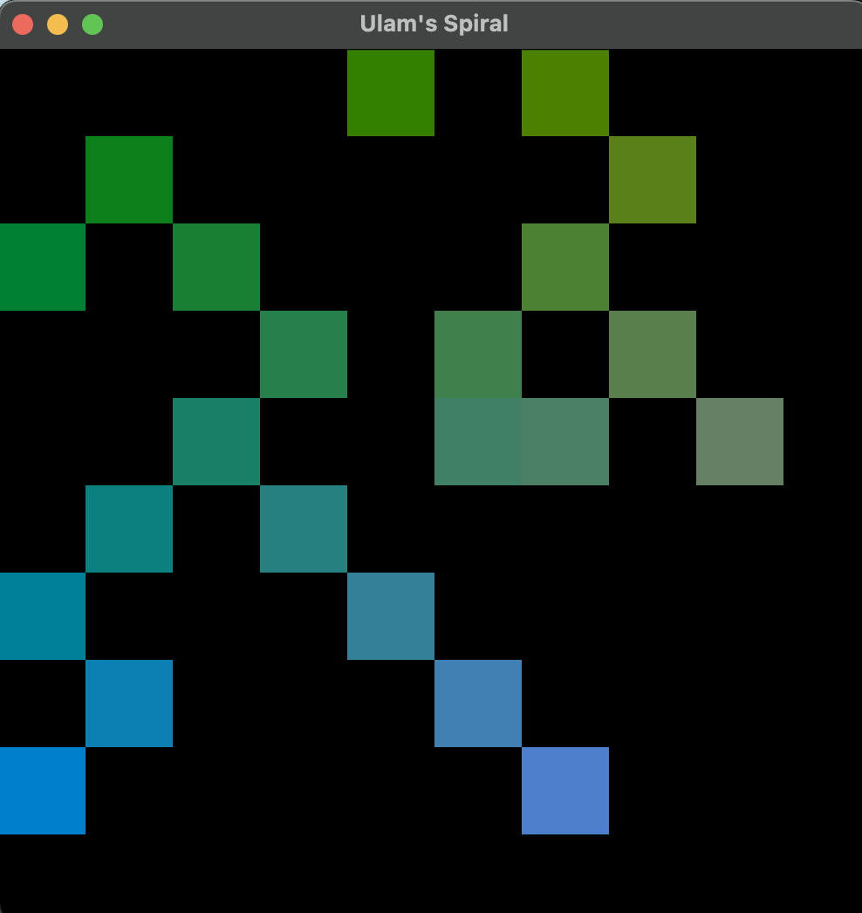
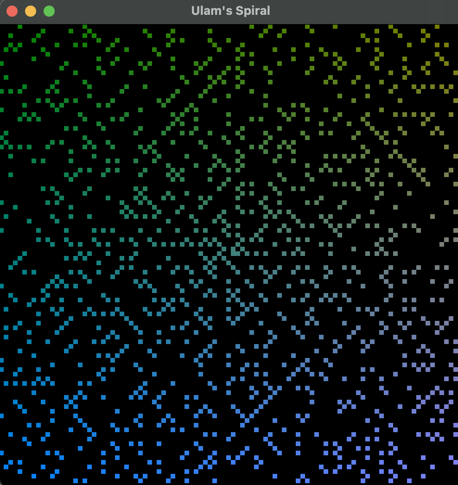
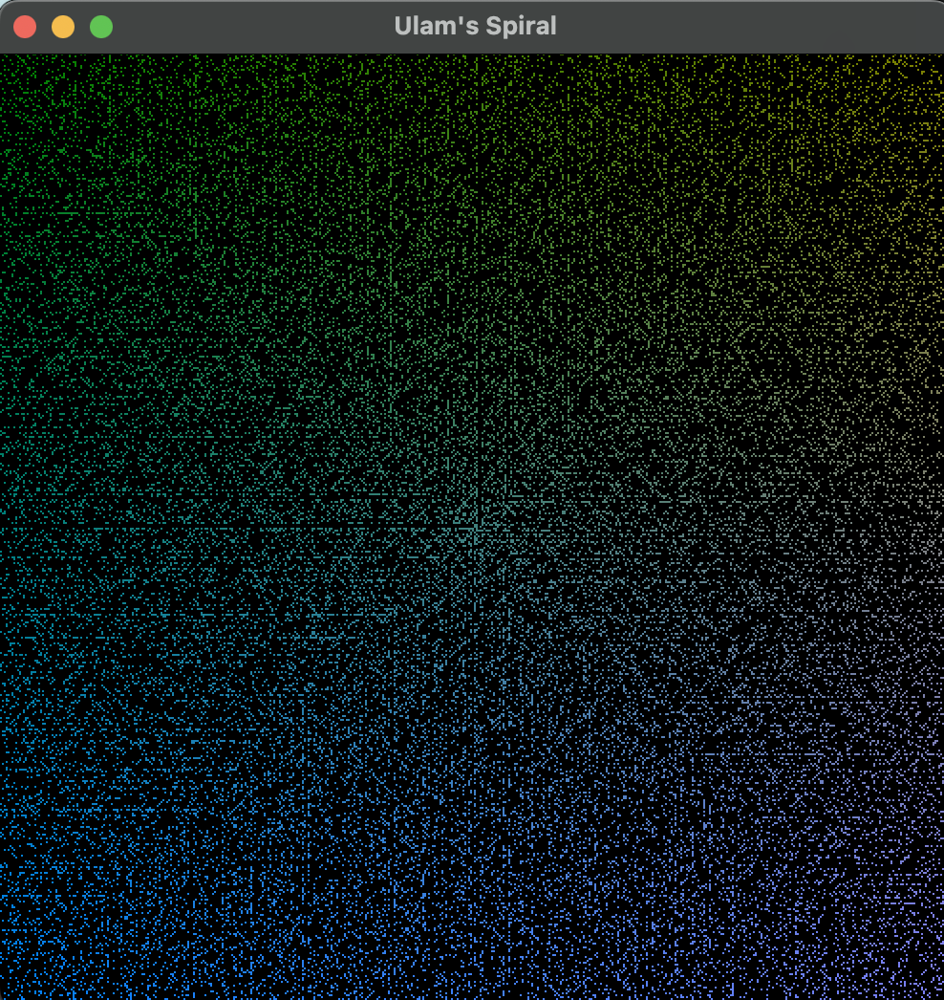

# ULAM'S SPIRAL

## Running
Make sure `CMakeLists.txt` contains `add_executable(main src/ulam_spiral/main.cpp)`

### Option 1 - Default Dimensions
Compile: `cmake -B build -DCMAKE_BUILD_TYPE=Release && cmake --build build --config Release`
Build: `./build/bin/main`

### Option 2 - Custom Dimensions
Add the size of rows and columns. Use even dimensions. You can run with odd dimensions, it will just round to an even number.

Compile: `cmake -B build -DCMAKE_BUILD_TYPE=Release && cmake --build build --config Release`
Build: `./build/bin/main <number>`

Example:  `./build/bin/main 200` will run with 200 rows and 200 columns

## Photos
### 10x10
</img>
### 100x100
</img>
### 1000x1000
</img>

## Code Explanations

<b>Calculating what iteration to stop at based on the size of the grid:</b>

<u>Note:</u> $i*8$ = total amount of elements in iteration $i$ \
One row contains $(i*8-4)/4 + 2$ elements. So, after some math, $i = (total\_rows-1)/2$
